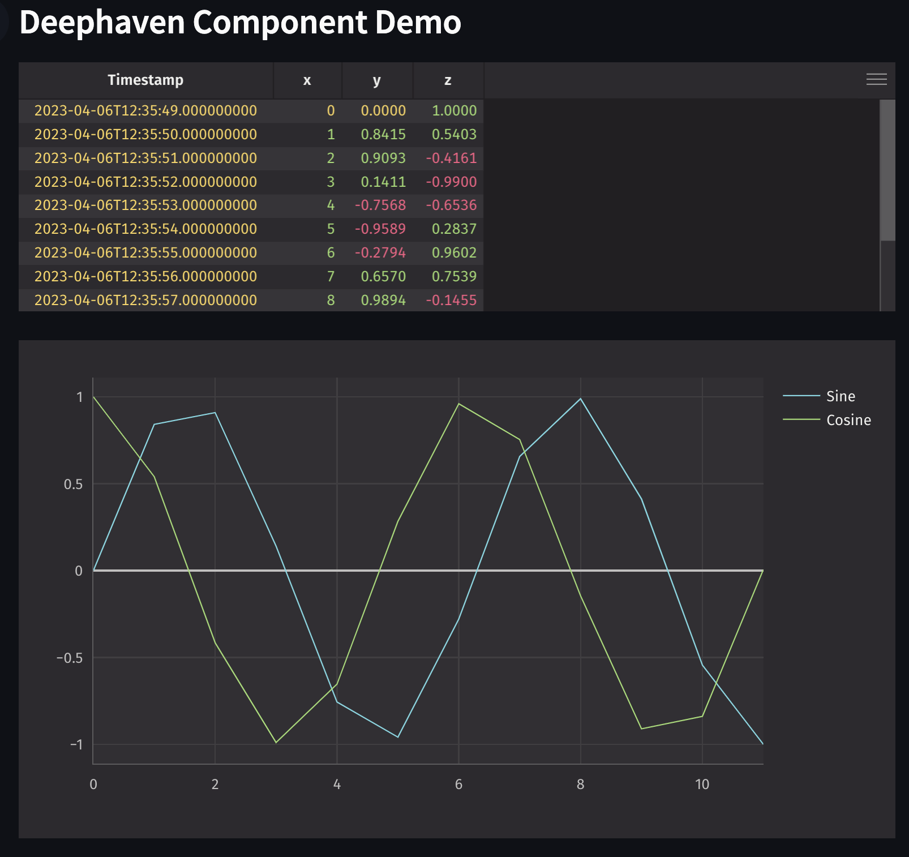

# Development Quickstart

Uses the [Streamlit component-template](https://github.com/streamlit/component-template).

- Create a new Python virtual environment for the template:

```
$ cd template
$ python3 -m venv .venv         # create venv
$ source .venv/bin/activate     # activate venv
$ pip install streamlit         # install streamlit
$ pip install deephaven-server  # install Deephaven server
```

- From a separate terminal, run the template's Streamlit app:

```
$ source .venv/bin/activate  # activate the venv you created earlier
$ streamlit run streamlit_deephaven/test_app.py  # run the example
```

- If all goes well, you should see something like this:



- Modify the Python code at `streamlit_deephaven/test_app.py`.

# Publishing

## Publishing to TestPyPi

Instructions from https://docs.streamlit.io/library/components/publish#upload-your-wheel-to-pypi

```
pip install wheel twine
python setup.py sdist bdist_wheel
python -m twine upload --repository testpypi dist/*
```

You can then install the test component in a new, different python project to ensure it's working:

```
python -m pip install --index-url https://test.pypi.org/simple/ --no-deps streamlit-deephaven
```

## Publishing to PyPi

When you're ready to publish to PyPi, follow similar steps to uploading to TestPyPi.

```
pip install wheel twine
python setup.py sdist bdist_wheel
python -m twine upload dist/*
```

You can then install the test component in a new, different python project to ensure it's working:

```
python -m pip install --index-url https://test.pypi.org/simple/ --no-deps streamlit-deephaven
```
